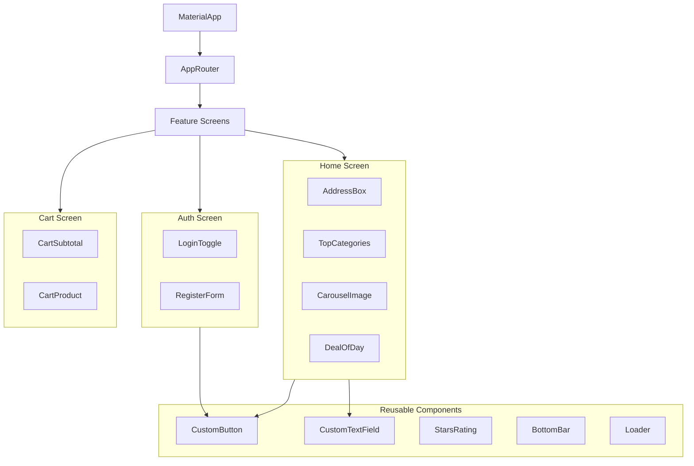

# Component Structure Diagram

## Frontend Architecture

### Atomic Design Principles
- **Common Widgets**: Foundational pieces used across all features (buttons, inputs).
- **Feature Modules**: Encapsulated UI logic for specific domains (Home, Account, Cart).
- **Providers**: Global state management (User information, localization).

### Routing
Uses the `onGenerateRoute` pattern for dynamic navigation and passing arguments between screens.
