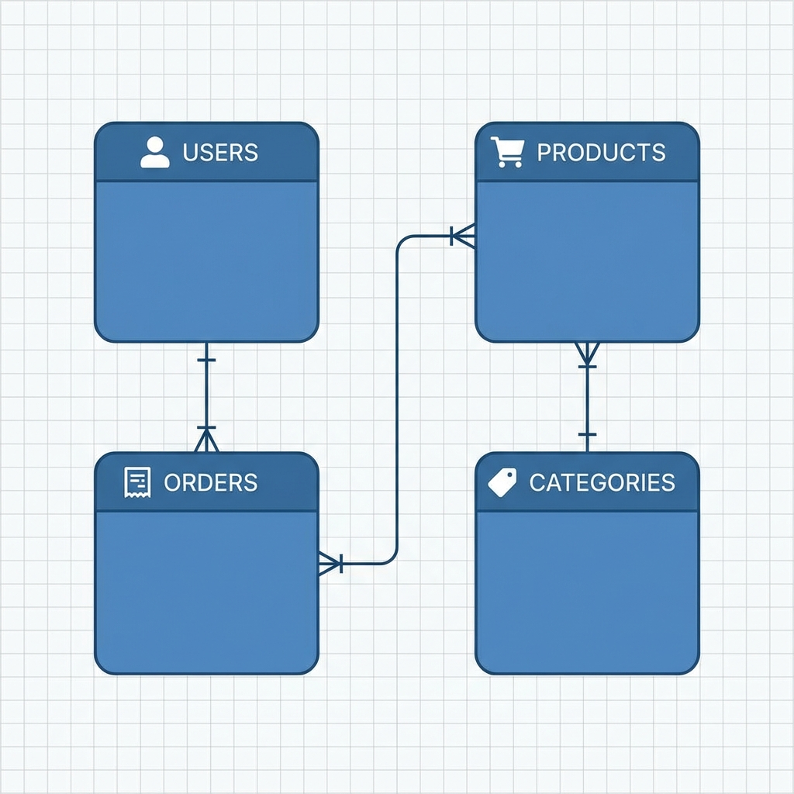
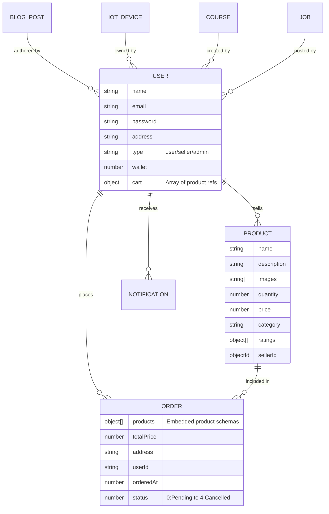

# Database Schema Diagram

## Entity Details

### User Entity
Central entity managing identity, roles (User, Seller, Admin), and the shopping experience (Cart, Wishlist, Wallet).

### Product Entity
Managed by Sellers. Contains inventory details, pricing, and nested ratings for performance.

### Order Entity
Captures a snapshot of products at the time of purchase. Tracks shipping status and delivery address.

### Specialized Entities
- **IoT Device**: For smart home integration tracking.
- **Job/Course/Property**: For the specialized marketplace modules.
- **Consultation/Event**: For service-based offerings.
