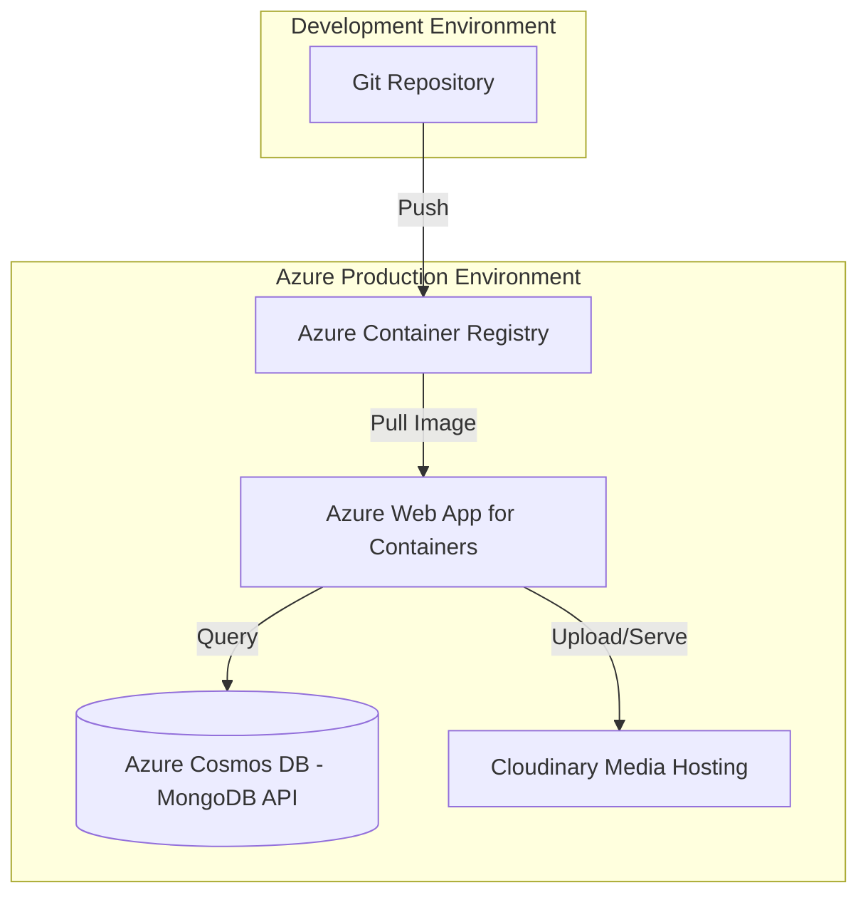

# Deployment Architecture Diagram

## Infrastructure Specs

### 1. Azure Hosting
- Uses **App Service** for hosting the Dockerized Node.js application.
- Scalability is managed via App Service Plans (S1 or P1v2).

### 2. Database Integration
- **Cosmos DB with MongoDB API**: Provides a managed, high-availability database environment compatible with existing Mongoose code.

### 3. Media Distribution
- Images are not stored on the app server. They are uploaded to **Cloudinary**, which provides optimized delivery via their global Content Delivery Network (CDN).

### 4. Containerization
- The `Dockerfile` in the root of the server project defines the immutable runtime environment, ensuring parity between local dev and production.
