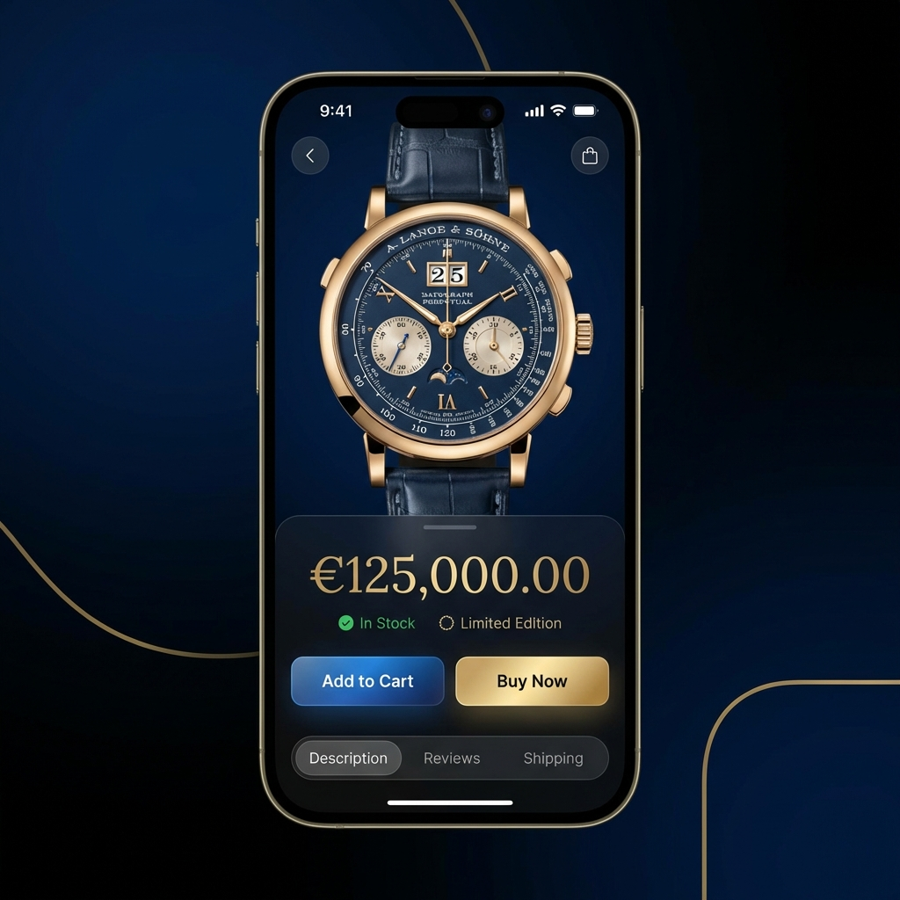

# UI/UX Mockup Diagram (Visual Design)

This document showcases the high-fidelity visual design direction for MarketHub.

## Design Philosophy
- **Modern Sleekness**: Utilizing a dark mode foundation to reduce eye strain and provide a premium feel.
- **Micro-interactions**: Subtle gradients on buttons and glassmorphism effects on cards.
- **Consistency**: High-quality product images paired with unified typography (Inter/Outfit).

## Home Screen Mockup
The home screen focuses on discoverability and quick access to categories and trending products.

## Product Detail Mockup
Product pages provide an immersive viewing experience, focusing on high-resolution imagery and clear calls to action.

## Key Visual Elements
1. **Glassmorphism**: Applied to the search bar and category tiles.
2. **Dynamic Theming**: Support for smooth transitions between light and dark modes.
3. **Hierarchy**: Bold pricing and clear CTAs (Buy Now / Add to Cart) to drive conversion.
