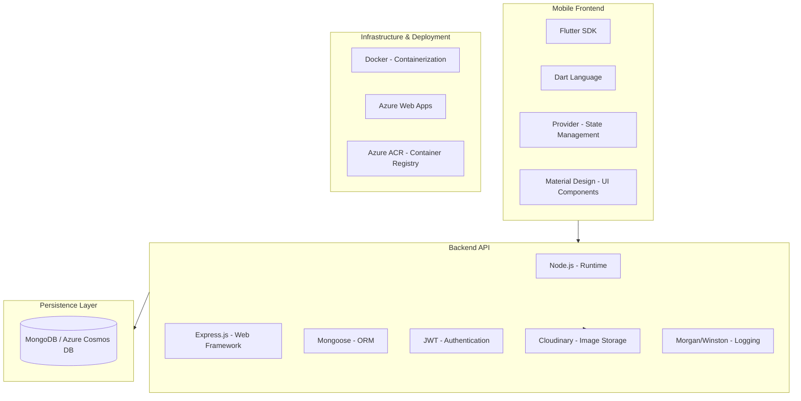

# Technology Stack Diagram

## Detailed Breakdown

### Frontend
- **Framework**: Flutter (Cross-platform)
- **State Management**: Provider
- **Networking**: Http (Dio conceptually)
- **Theming**: Dynamic Dark/Light Mode

### Backend
- **Platform**: Node.js
- **Framework**: Express.js
- **Authentication**: JWT (Stateless)
- **Security**: Helmet, Rate Limiting, CORS

### Database
- **Primary**: MongoDB (via Azure Cosmos DB)
- **Storage**: Cloudinary for product and user images

### Deployment
- **Container**: Docker
- **Cloud**: Azure
- **CI/CD**: Git based workflows
