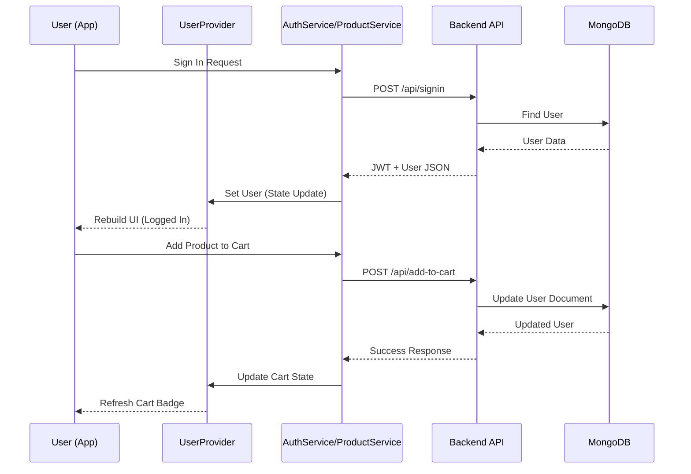

# Data Flow Diagram

## Data Movement Principles

### 1. Unidirectional Data Flow
UI triggers actions -> Services handle networking -> State (Provider) updates -> UI re-renders based on the new state.

### 2. State Syncing
Local state (UserProvider) is kept in sync with the remote Database through API responses. This ensures consistent data even after complex mutations like cart additions.

### 3. Persistent Auth
The JWT token is cached in local storage and injected into headers by services for all authenticated requests.
