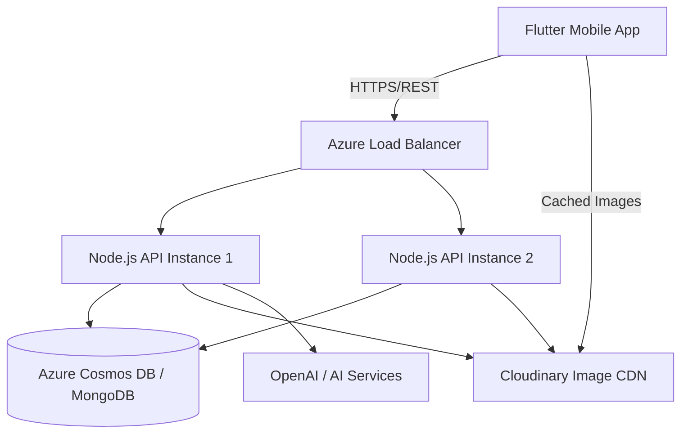

# System Architecture Diagram

## Component Roles

### 1. Flutter Mobile Application
Handles all presentation logic, local state management (Provider), and asynchronous API communication. Uses localized themes for premium UX.

### 2. Azure Infrastructure
- **Load Balancer**: Distributes incoming traffic across multiple API instances for high availability.
- **Web App for Containers**: Hosts the Dockerized Node.js environment.

### 3. Node.js Backend
A stateless REST API layer. It validates tokens, enforces rate limits, handles business logic (order math, inventory checks), and interacts with external services.

### 4. Data Layer
- **MongoDB**: Primary document store for users, orders, and products.
- **Cloudinary**: High-performance image distribution and transformations.
- **AI Integration**: Powers smart features like chatbots or personalized recommendations.
