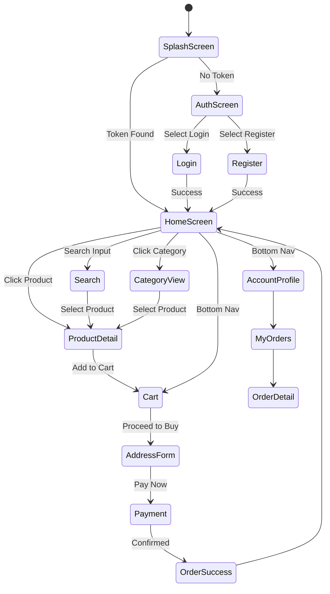

# User Flow Diagram

## Primary Flows

### 1. Purchase Funnel
The path from discovering a product via Search/Categories to completing a checkout. Includes state persistence for the shopping cart.

### 2. Authentication Lifecycle
Ensures secure access. Uses JWT tokens stored locally on the device to bypass logins on subsequent app launches.

### 3. Order Management
Allows users to track their purchase history and view specific delivery statuses (Pending -> Delivered).
